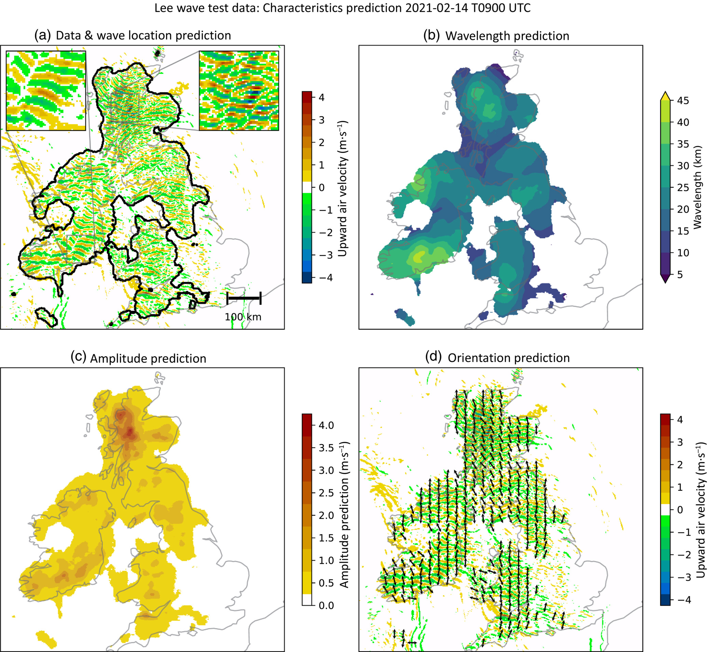

# LIFD Machine Learning For Earth Sciences

      

Leeds Institute for Fluid Dynamics (LIFD) has teamed up with the Centre for Environmental Modelling and Computation (CEMAC) team to create Jupyter notebook tutorials on the following topics.

1. [PINNS](#Physics-Informed-Neural-Networks)
2. [Image Seg](#Image-Segmentation)
3. [AE](#Auto-Encoders)
4. [Data driven](#Data-driven-models)
5. [GP](#Gaussian-Processes)

These notebooks are accompanied by taught lectures, however they should also function as standalone tutorials.

## How to Run

These notebooks can run with the resources provided and the Anaconda environment setup. If you are familiar with Anaconda, Jupyter notebooks and GitHub then simply clone this repository and run it within your Jupyter notebook setup. Otherwise, please read the [how to run](howtorun.md) guide. These are designed to run on Leeds linux GPU work stations although can work colab or other GPU enabled platforms, where run times on a single GPU are deemed unacceptable links to pretrained models are provided.

# Physics-Informed Neural Networks

### [1D Heat Equation and Navier Stokes Equation](https://github.com/cemac/LIFD_Torch_PINNS)

Recent developments in machine learning have gone hand in hand with a large growth in available data and computational resources. However, often when analysing complex physical systems, the cost of data acquisition can be prohibitively large. In this small data regime, the usual machine learning techniques lack robustness and do not guarantee convergence.

Fortunately, we do not need to rely exclusively on data when we have prior knowledge about the system at hand. For example, in a fluid flow system, we know that the observational measurements should obey the Navier-Stokes equations, and so we can use this knowledge to augment the limited data we have available. This is the principle behind physics-informed neural networks (PINNs).

These notebooks illustrate using PINNs to explore the 1D heat equation and Navier Stokes Equation.  

In the Navier Stokes example notebook, sparse velocity data points (blue dots) are used to infer fluid flow patterns in the wake of a cylinder and unknown velocity and pressure fields are predicted using only a discrete set of measurements of a concentration field c(t,x,y).

These examples are based on work from the following two papers:
* M. Raissi, P. Peridakis, G. Karniadakis, Physics Informed Deep Learning (Part II): Data-driven Discovery of Nonlinear Partial Differential Equations, 2017
* M. Raissi, A. Yazdani, G. Karniadakis, Hidden Fluid Mechanics: A Navier-Stokes Informed Deep Learning Framework for Assimilating Flow Visualization Data, 2018

# Image Segmentation

### [Image Segmentation](https://github.com/cemac/LIFD_ImageSegmentation)

Image segmentation models are designed to tackle the problem of partitioning an image into meaningful segments or regions, each corresponding to different objects or parts of objects within the image. This process is crucial in various applications such as medical imaging, where it helps in identifying and isolating different anatomical structures (e.g. organs or tumours), or in autonomous driving, where it can aid in recognising and distinguishing between pedestrians, vehicles, and road signs. More recently, segmentation models are being applied to weather and climate forecasting applications, where their ability to identify structures in image data makes them ideally suited.

This Jupyter notebook demonstrates how artificial neural networks (ANNs) can be applied to image segmentation problems. We present a simple application to self-driving cars, where we train a U-Net segmentation model to identify important features in dashcam footage, as well as a more complicated example, based on the work of Coney et al. (2023), identifying and characterising trapped lee waves over the UK.

*Figure from Coney et al. (2024)*

References:

* Ronneberger, O., Fischer, P., Brox, T. (2015). U-Net: Convolutional Networks for Biomedical Image Segmentation. In: Navab, N., Hornegger, J., Wells, W., Frangi, A. (eds) Medical Image Computing and Computer-Assisted Intervention – MICCAI 2015. MICCAI 2015. Lecture Notes in Computer Science(), vol 9351. Springer, Cham. [https://doi.org/10.1007/978-3-319-24574-4_28](https://doi.org/10.1007/978-3-319-24574-4_28)
*  Coney, J., Denby, L., Ross, A.N., Wang, H., Vosper, S., van Niekerk, A., et al. (2024) Identifying and characterising trapped lee waves using deep learning techniques. Quarterly Journal of the Royal Meteorological Society, 150(758), 213–231. Available from: [https://doi.org/10.1002/qj.4592](https://doi.org/10.1002/qj.4592)
  
# AutoEncoders

[AutoEncoders](https://github.com/cemac/LIFD_TorchAutoEncoders)

*to be filled*

AutoEncoders are unsupervised learning technique that performs data encoding and decoding using feed forward neural networks made of two components:

* **Encoder** translates input data into lower dimensional space. (lower dimensional encoding is referred to as the latent space representation) 	 

* **Decoder** tries to reconstruct the original 	data from the lower dimensional data 	 

References:

# Data Driven Models

*coming soon*

# Gauassian Processes

*comming soon*

# Licence information #

 LIFD_CDT_NOTEBOOKS by <a xmlns:cc="http://creativecommons.org/ns#" href="http://cemac.leeds.ac.uk/" property="cc:attributionName" rel="cc:attributionURL">CEMAC</a> is licensed under a <a rel="license" href="http://creativecommons.org/licenses/by/4.0/">Creative Commons Attribution 4.0 International License</a>.

## Acknowledgements
